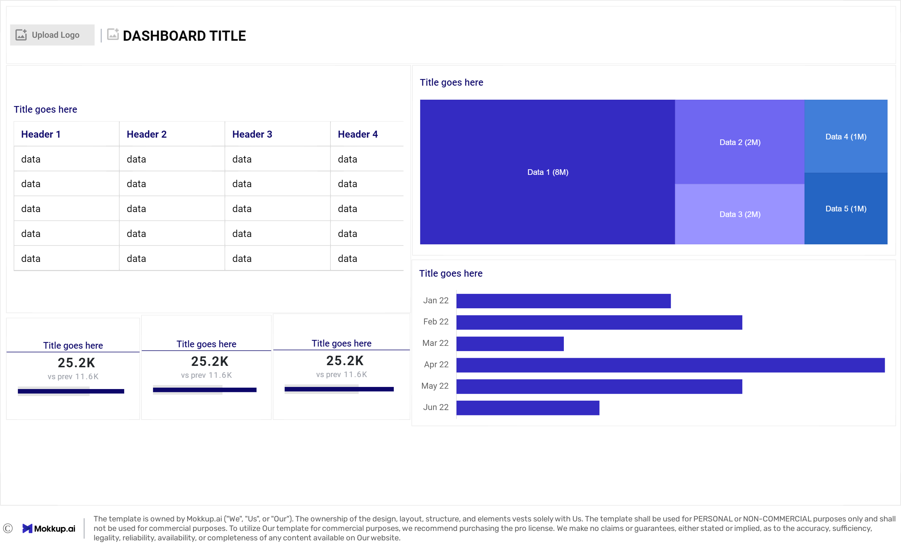
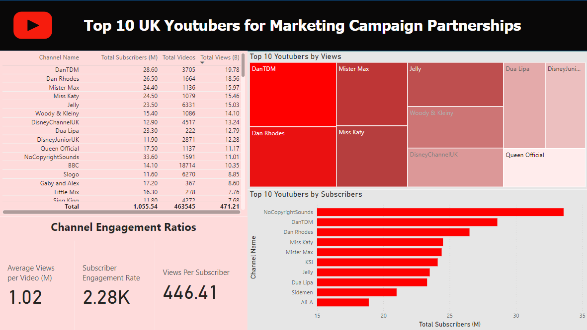
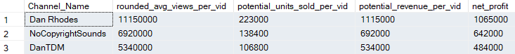
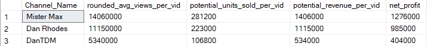
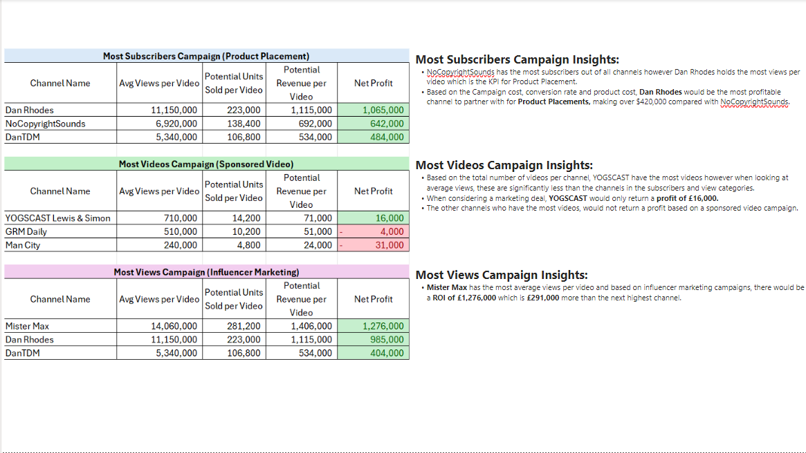

# Data Portfolio: Youtube Channel Marketing Ananlysis (Excel - SQL - Power BI)


# Table of Contents

- [Objective](#Objective)
  - [User Story](#User_Story)
- [Data Source](#Data_Source)
- [Stages](#Stages)
- [Design](#Design)
  - [Dashboard Mockup](#Dashboard_Mockup)
  - [Tools](#Tools)
- [Development](#Development)
  - [Pseudocode](#Pseudocode)
  - [Data Exploration](#Data_Exploration)
  - [Data Cleaning](#Data_Cleaning)
  - [Transform the data](#Transform_the_data)
  - [Create SQL View](#Create_SQL_View)
- [Testing](#Testing)
  - [Data Quality Tests](#Data_Quality_Tests)
- [Visualisation](#Visualisation)
  - [Results](#Results)
  - [DAX Measures](#DAX_Measures)
- [Analysis](#Analysis)
  - [Findings](#Findings)
  - [Validation](#Validation)
- [Conclusion](#Conclusion)
  - [Discovery](#Discovery)
  - [Recommendations](#Recommendations)
  - [Potential ROI](#Potential_ROI)
  - [Course of Action](#Course_of_Action)


# Objective
- Key issue:

The marketing team wants to find who the best Youtubers of 2024 are to set up marketing campaigns.

- Proposed Solution:
  
A dashboard will be created to provide actionable insights into the top Youtubers (UK) in 2024. The dashboard will include:
- Subscriber count
- Total views
- Total videos
- Engagement metrics
  
These metrics will assist the marketing team decide on which Youtubers would be best for the proposed marketing campaigns.

## User Story
" As the lead of the marketing team, I need to visualise key metrics through an informative dashboard to analyse UK Youtuber channel data.

This should allow our team to identify the top performing channels through engagement metrics. The insights gathered will drive decisions about who is best to partner with for our new marketing campaigns and maximise potential ROI"

# Data Source

- We need engagement data on the top UK Youtubers in 2024 that includes:
  - Channel names
  - Total subscribers
  - Total views
  - Total videos uploaded
  - Where the data is coming from? (The data is sourced from Kaggle Excel found [here](https://www.kaggle.com/datasets/bhavyadhingra00020/top-100-social-media-influencers-2024-countrywise?resource=download))
  
# Stages

1. Design
2. Development
3. Testing
4. Analysis
   
# Design

## Dashboard Questions
- What should the dashboard contain based on the above requirements?
  
- What are the initial insight questions the dashboard needs to answer?
1. Top 10 Youtubers with the most subscribers?
2. Top 3 channels with the most uploads?
3. Top 3 channels with the most views?
4. Top 3 channels with the highest average views per video?
5. Top 3 channels with the highest views per subscriber ratio?
6. Top 3 channels with the highest subscriber engagement rate per video uploaded?

As we progress through the analysis, these questions may develop.

## Dashboard Mockup

Recommended data visuals:
1. Table
2. Treemap
3. Scorecards
4. Horizontal bar chart



## Tools

| Tool  | Purpose                                                   |
| --------- | ----------------------------------------------------- |
| Excel     | Exploring the data                                    |
| SQL       | Cleaning, testing and analysing the data              |
| Power BI  | Visualizing the data and gathering insights           |
| GitHub    | Hosting the project documentation and version control |
| Mokkup AI | Designing the wireframe of the dashboard              |


# Development
## Pseudocode

- What is the general approach to solving the issue from end to end?

1. Gather the data
2. Explore the data in Excel
3. Load the data into SQL
4. Clean the data in SQL
5. Test the data in SQL
6. Visualise the data in Power BI
7. Generate the findings based on the insights
8. Write-up documentation and commentary
9. Publish the data to relevant stakeholders


## Data Exploration

The gathered data will be audited for quality looking mainly for errors, inconsistencies, bugs and unusual characters and/or layout of data etc.

- What are the findings from the data exploration?

1. All relevant data is present within the files gathered so no need to request more data.
2. The first column contains the channel ID but is named " channel IDS " which are seperated but an @ symbol. Channel names need to be extracted from this.
3. Some cell header names are in a different language and need to confirm or deny if these columns are required.
4. Some irrelevant columns will need to be removed.

## Data Cleaning

- What do we expect the clean data to contain and what constraints are required?

1. Relevant columns should be retained.
2. All data types should be appropriate for the contents of each column.
3. There should be no null values i.e. complete data for all records.

Below is a table outlining the constraints to be applied:

| Property          | Description |
| ----------------- | ----------- |
| Number of Rows    | 100         |
| Number of Columns | 4           |

Included is also a table of the expected schema for the cleaned data:

| Column Name       | Data Type | Nullable |
| ----------------- | --------- | -------- |
| channel_name      | VARCHAR   | NO       |
| total_subscribers | INTEGER   | NO       |
| total_videos      | INTEGER   | NO       |
| total_views       | INTEGER   | NO       |

- What are the steps needed to clean and shape the data?

1. Remove unnecessary columns
2. Extract Youtuber channel names
3. Rename columns using aliases

### Transform the Data

```sql
/*
# 1. Select the required columns
# 2. Extract the channel name from the 'NOMBRE' column
*/

-- 1.
SELECT
    SUBSTRING(NOMBRE, 1, CHARINDEX('@', NOMBRE) -1) AS channel_name,  -- 2.
    total_subscribers,
    total_views,
    total_videos

FROM
    top_uk_youtubers_2024
```

### Create the SQL View

```sql
/*
# 1. Create a view to store the transformed data
# 2. Cast the extracted channel name as VARCHAR(100)
# 3. Select the required columns from the top_uk_youtubers_2024 SQL table 
*/

-- 1.
CREATE VIEW view_uk_youtubers_2024 AS

-- 2.
SELECT
    CAST(SUBSTRING(NOMBRE, 1, CHARINDEX('@', NOMBRE) -1) AS VARCHAR(100)) AS channel_name, -- 2. 
    total_subscribers,
    total_views,
    total_videos

-- 3.
FROM
    top_uk_youtubers_2024

```

# Testing
## Data quality tests

- What are the data quality tests?

## Row count check

```sql
/*
# Count the total number of records (or rows) are in the SQL view
*/

SELECT
    COUNT(*) AS no_of_rows
FROM
    view_uk_youtubers_2024;

```


## Column count check
### SQL query

```sql
/*
# Count the total number of columns (or fields) are in the SQL view
*/


SELECT
    COUNT(*) AS column_count
FROM
    INFORMATION_SCHEMA.COLUMNS
WHERE
    TABLE_NAME = 'view_uk_youtubers_2024'
```


## Data type check
### SQL query

```sql
/*
# Check the data types of each column from the view by checking the INFORMATION SCHEMA view
*/

-- 1.
SELECT
    COLUMN_NAME,
    DATA_TYPE
FROM
    INFORMATION_SCHEMA.COLUMNS
WHERE
    TABLE_NAME = 'view_uk_youtubers_2024';
```


## Duplicate count check
### SQL query

```sql
/*
# 1. Check for duplicate rows in the view
# 2. Group by the channel name
# 3. Filter for groups with more than one row
*/

-- 1.
SELECT
    channel_name,
    COUNT(*) AS duplicate_count
FROM
    view_uk_youtubers_2024

-- 2.
GROUP BY
    channel_name

-- 3.
HAVING
    COUNT(*) > 1;
```


# Visualization

## Results

How does the dashboards look?




## DAX Measures

### 1. Total Subscribers (M)

```sql
Total Subscribers (M) = 
VAR million = 1000000
VAR sumOfSubscribers = SUM(view_uk_youtubers_2024[total_subscribers])
VAR totalSubscribers = DIVIDE(sumOfSubscribers,million)

RETURN totalSubscribers

```

### 2. Total Views (B)

```sql
Total Views (B) = 
VAR billion = 1000000000
VAR sumOfTotalViews = SUM(view_uk_youtubers_2024[total_views])
VAR totalViews = ROUND(sumOfTotalViews / billion, 2)

RETURN totalViews

```

### 3. Total Videos

```sql
Total Videos = 
VAR totalVideos = SUM(view_uk_youtubers_2024[total_videos])

RETURN totalVideos

```

### 4. Average Views Per Video (M)

```sql
Average Views per Video (M) = 
VAR sumOfTotalViews = SUM(view_uk_youtubers_2024[total_views])
VAR sumOfTotalVideos = SUM(view_uk_youtubers_2024[total_videos])
VAR  avgViewsPerVideo = DIVIDE(sumOfTotalViews,sumOfTotalVideos, BLANK())
VAR finalAvgViewsPerVideo = DIVIDE(avgViewsPerVideo, 1000000, BLANK())

RETURN finalAvgViewsPerVideo 

```


### 5. Subscriber Engagement Rate

```sql
Subscriber Engagement Rate = 
VAR sumOfTotalSubscribers = SUM(view_uk_youtubers_2024[total_subscribers])
VAR sumOfTotalVideos = SUM(view_uk_youtubers_2024[total_videos])
VAR subscriberEngRate = DIVIDE(sumOfTotalSubscribers, sumOfTotalVideos, BLANK())

RETURN subscriberEngRate 

```


### 6. Views per subscriber

```sql
Views Per Subscriber = 
VAR sumOfTotalViews = SUM(view_uk_youtubers_2024[total_views])
VAR sumOfTotalSubscribers = SUM(view_uk_youtubers_2024[total_subscribers])
VAR viewsPerSubscriber = DIVIDE(sumOfTotalViews, sumOfTotalSubscribers, BLANK())

RETURN viewsPerSubscriber 

```

# Analysis
## Findings

In this section we will answer our design stage questions:
1. Top 10 Youtubers with the most subscribers?
2. Top 3 channels with the most uploads?
3. Top 3 channels with the most views?
4. Top 3 channels with the highest average views per video?
5. Top 3 channels with the highest views per subscriber ratio?
6. Top 3 channels with the highest subscriber engagement rate per video uploaded?

### 1. Top 10 Youtubers with the most subscribers?

| Rank | Channel Name         | Subscribers (M) |
|------|----------------------|-----------------|
| 1    | NoCopyrightSounds    | 33.60           |
| 2    | DanTDM               | 28.60           |
| 3    | Dan Rhodes           | 26.50           |
| 4    | Miss Katy            | 24.50           |
| 5    | Mister Max           | 24.40           |
| 6    | KSI                  | 24.10           |
| 7    | Jelly                | 23.50           |
| 8    | Dua Lipa             | 23.30           |
| 9    | Sidemen              | 21.00           |
| 10   | Ali-A                | 18.90           |


### 2. Top 3 channels with the most uploads?

| Rank | Channel Name    | Videos Uploaded |
|------|-----------------|-----------------|
| 1    | GRM Daily       | 14,696          |
| 2    | Manchester City | 8,248           |
| 3    | Yogscast        | 6,435           |


### 3. Top 3 channels with the most views?

| Rank | Channel Name | Total Views (B) |
|------|--------------|-----------------|
| 1    | DanTDM       | 19.78           |
| 2    | Dan Rhodes   | 18.56           |
| 3    | Mister Max   | 15.97           |


### 4. Top 3 channels with the highest average views per video?

| Channel Name | Averge Views per Video (M) |
|--------------|-----------------|
| Mark Ronson  | 32.27           |
| Jessie J     | 5.97            |
| Dua Lipa     | 5.76            |

### 5. Top 3 channels with the highest views per subscriber ratio?

| Rank | Channel Name       | Views per Subscriber        |
|------|-----------------   |---------------------------- |
| 1    | GRM Daily          | 1185.79                     |
| 2    | Nickelodeon        | 1061.04                     |
| 3    | Disney Junior UK   | 1031.97                     |

### 6. Top 3 channels with the highest subscriber engagement rate per video uploaded?

| Rank | Channel Name    | Subscriber Engagement Rate  |
|------|-----------------|---------------------------- |
| 1    | Mark Ronson     | 343,000                     |
| 2    | Jessie J        | 110,416.67                  |
| 3    | Dua Lipa        | 104,954.95                  |


### Outcome

For the next steps we need to look at analysing the metrics that are key for generating the expected ROI for the client:

1. Subscribers
2. Total views
3. Videos uploaded

## Validation

### 1. Youtubers with the most subscribers 

#### Calculation breakdown

Campaign Subject: Product Placement

Key variables:
- Product cost = £5
- Conversion Rate = 2%
- Campaign Cost (one-time fee) = £50,000

a. NoCopyrightSounds 

- Average views per video = 6.92 million
- Potential units sold per video = 6.92 million x conversion rate = 138,400 units sold
- Potential revenue per video = 138,400 x product cost = £692,000
- **Net profit = £692,000 - campaign cost = £642,000**

b. DanTDM

- Average views per video = 5.34 million
- Potential units sold per video = 5.34 million x conversion rate = 106,800 units sold
- Potential revenue per video = 106,800 x product cost = £534,000
- **Net profit = £534,000 - campaign cost = £484,000**

c. Dan Rhodes

- Average views per video = 11.15 million
- Potential units sold per video = 11.15 million x conversion rate = 223,000 units sold
- Potential revenue per video = 223,000 x product cost = £1,115,000
- **Net profit = £1,115,000 - campaign cost = £1,065,000**

Best choice from category: **Dan Rhodes**

#### SQL query

```sql
/* 

# 1. Define variables 
# 2. Create a CTE that rounds the average views per video 
# 3. Select the column you need and create calculated columns from existing ones 
# 4. Filter results by Youtube channels
# 5. Sort results by net profits (from highest to lowest)

*/


-- 1. 
DECLARE @conversionRate FLOAT = 0.02;		-- The conversion rate @ 2%
DECLARE @productCost FLOAT = 5.0;			-- The product cost @ $5
DECLARE @campaignCost FLOAT = 50000.0;		-- The campaign cost @ $50,000	


-- 2.  
WITH ChannelData AS (
    SELECT 
        channel_name,
        total_views,
        total_videos,
        ROUND((CAST(total_views AS FLOAT) / total_videos), -4) AS rounded_avg_views_per_video
    FROM 
        youtube_db.dbo.view_uk_youtubers_2024
)

-- 3. 
SELECT 
    channel_name,
    rounded_avg_views_per_video,
    (rounded_avg_views_per_video * @conversionRate) AS potential_units_sold_per_video,
    (rounded_avg_views_per_video * @conversionRate * @productCost) AS potential_revenue_per_video,
    ((rounded_avg_views_per_video * @conversionRate * @productCost) - @campaignCost) AS net_profit
FROM 
    ChannelData


-- 4. 
WHERE 
    channel_name in ('NoCopyrightSounds', 'DanTDM', 'Dan Rhodes')    


-- 5.  
ORDER BY
	net_profit DESC

```

#### Output



### 2. Youtubers with the most videos uploaded

### Calculation breakdown 

Campaign Subject: Sponsored video series (11 video deal)

Key variables:
- Product cost = £5
- Conversion Rate = 2%
- Campaign Cost (11-videos @ £5,000) = £55,000

a. GRM Daily
- Average views per video = 510,000
- Potential units sold per video = 510,000 x conversion rate = 10,200 units sold
- Potential revenue per video = 10,200 x product cost = £51,000
- **Net profit = £51,000 - campaign cost = -£4,0000 (potential LOSS)**
  
b. Manchester City
- Average views per video = 240,000
- Potential units sold per video = 240,000 x conversion rate = 4,800 units sold
- Potential revenue per video = 4,800 x product cost = £24,000
- **Net profit = £24,000 - campaign cost = -£31,000 (potential LOSS)**

c. Yogscast
- Average views per video = 710,000
- Potential units sold per video = 710,000 x conversion rate = 14,200 units sold
- Potential revenue per video = 14,200 x product cost = £71,000
- **Net profit = £71,000 - campaign cost = £16,000 (PROFIT)**


Best choice from category: **Yogscast**

#### SQL query 
```sql
/* 
# 1. Define variables
# 2. Create a CTE that rounds the average views per video
# 3. Select the columns you need and create calculated columns from existing ones
# 4. Filter results by YouTube channels
# 5. Sort results by net profits (from highest to lowest)
*/


-- 1.
DECLARE @conversionRate FLOAT = 0.02;           -- The conversion rate @ 2%
DECLARE @productCost FLOAT = 5.0;               -- The product cost @ $5
DECLARE @campaignCostPerVideo FLOAT = 5000.0;   -- The campaign cost per video @ $5,000
DECLARE @numberOfVideos INT = 11;               -- The number of videos (11)


-- 2.
WITH ChannelData AS (
    SELECT
        channel_name,
        total_views,
        total_videos,
        ROUND((CAST(total_views AS FLOAT) / total_videos), -4) AS rounded_avg_views_per_video
    FROM
        youtube_db.dbo.view_uk_youtubers_2024
)


-- 3.
SELECT
    channel_name,
    rounded_avg_views_per_video,
    (rounded_avg_views_per_video * @conversionRate) AS potential_units_sold_per_video,
    (rounded_avg_views_per_video * @conversionRate * @productCost) AS potential_revenue_per_video,
    ((rounded_avg_views_per_video * @conversionRate * @productCost) - (@campaignCostPerVideo * @numberOfVideos)) AS net_profit
FROM
    ChannelData


-- 4.
WHERE
    channel_name IN ('GRM Daily', 'Man City', 'YOGSCAST Lewis & Simon ')


-- 5.
ORDER BY
    net_profit DESC;
```

#### Output


### 3.  Youtubers with the most views 

#### Calculation breakdown

Campaign Subject: Influencer Marketing (3 Month deal)

Key variables:
- Product cost = £5
- Conversion Rate = 2%
- Campaign Cost (3-month deal @ £5,000) = £130,000

a. DanTDM
- Average views per video = 5.34 million
- Potential units sold per video = 5.34 million x conversion rate = 106,800 units sold
- Potential revenue per video = 106,800 x product cost = £534,000
- **Net profit = £534,000 - campaign cost = £404,000**

b. Dan Rhodes
- Average views per video = 11.15 million
- Potential units sold per video = 11.15 million x conversion rate = 223,000 units sold
- Potential revenue per video = 223,000 x product cost = £1,115,000
- **Net profit = £1,115,000 - campaign cost = £985,000**

c. Mister Max
- Average views per video = 14.06 million
- Potential units sold per video = 14.06 million x conversion rate = 281,200 units sold
- Potential revenue per video = 281,200 x product cost = £1,406,000
- **Net profit = £1,406,000 - campaign cost = £1,276,000**


Best choice from category: **Mister Max**

#### SQL query 
```sql
/*
# 1. Define variables
# 2. Create a CTE that rounds the average views per video
# 3. Select the columns you need and create calculated columns from existing ones
# 4. Filter results by YouTube channels
# 5. Sort results by net profits (from highest to lowest)
*/


-- 1.
DECLARE @conversionRate FLOAT = 0.02;        -- The conversion rate @ 2%
DECLARE @productCost MONEY = 5.0;            -- The product cost @ $5
DECLARE @campaignCost MONEY = 130000.0;      -- The campaign cost @ $130,000


-- 2.
WITH ChannelData AS (
    SELECT
        channel_name,
        total_views,
        total_videos,
        ROUND(CAST(total_views AS FLOAT) / total_videos, -4) AS avg_views_per_video
    FROM
        youtube_db.dbo.view_uk_youtubers_2024
)


-- 3.
SELECT
    channel_name,
    avg_views_per_video,
    (avg_views_per_video * @conversionRate) AS potential_units_sold_per_video,
    (avg_views_per_video * @conversionRate * @productCost) AS potential_revenue_per_video,
    (avg_views_per_video * @conversionRate * @productCost) - @campaignCost AS net_profit
FROM
    ChannelData


-- 4.
WHERE
    channel_name IN ('Mister Max', 'DanTDM', 'Dan Rhodes')


-- 5.
ORDER BY
    net_profit DESC;

```

#### Output



# Conclusion
## Discovery

What were the overall findings?


1. NoCopyrightSOunds, Dan Rhodes and DanTDM are the channnels with the most subscribers in the UK
2. GRM Daily, Man City and Yogscast are the channels with the most videos uploaded
3. DanTDM, Dan RHodes and Mister Max are the channels with the most views
4. Entertainment channels are useful for broader reach, as the channels posting consistently on their platforms and generating the most engagement are focus on entertainment and music 

## Recommendations

Actionable Insights:



1. **Dan Rhodes** is the best YouTube channel to collaborate with if we want to **maximize visbility** because this channel has the **most YouTube subscribers in the UK**.
   
2. Although GRM Daily, Man City and Yogcasts are regular publishers on YouTube, it may be worth considering whether collaborating with them with the current budget caps are worth the effort, as the potential return on investments is significantly lower compared to the other channels.
   
3. **Mister Max** is the best YouTuber to collaborate with if we're interested in **maximizing reach**, but collaborating with **DanTDM and Dan Rhodes** may be better **long-term options** considering the fact that they both have large subscriber bases and are averaging significantly high number of views.
   
4. The top 3 channels to form collaborations with are **NoCopyrightSounds**, **DanTDM** and **Dan Rhodes** based on this analysis, because they attract the most engagement on their channels consistently.


## Potential ROI
What ROI is expected based on the actionable insights?

1. Setting up a **product placement** deal with **Dan Rhodes** would make the client a net profit of **£1,065,000 per video**.
2. An **influencer marketing contract** with **Mister Max** can see the client generate a net profit of **£1,276,000**.
3. If we go with a **product placement campaign** with **DanTDM**, this could  generate the client approximately **£484,000 per video**. If we advance with an **influencer marketing campaign** deal instead, this would make the client a one-off net profit of **£404,000**.
4. **NoCopyrightSounds product placement** could profit the client **£642,000 per video** too (which is worth considering). 


## Course of Action

Based on the analysis, the best channel to partner with on a **product placement** deal would be **Dan Rhodes**.
This initial deal will be assessed againsts the marketing teams initial forecasting. If the milestones are met throughout the deal, then future partnerships with DanTDM, Mister Max and NoCopyrightSounds can be advanced.

Actioning the Insights:

1. Reach out to the teams behind each of these channels, starting with Dan Rhodes.
2. Negotiate contracts within the budgets allocated to each marketing campaign.
3. Kick off the campaigns and track each of their performances against the KPIs.
4. Review how the campaigns have gone, gather insights and optimize based on feedback from converted customers and each channel's audiences.
